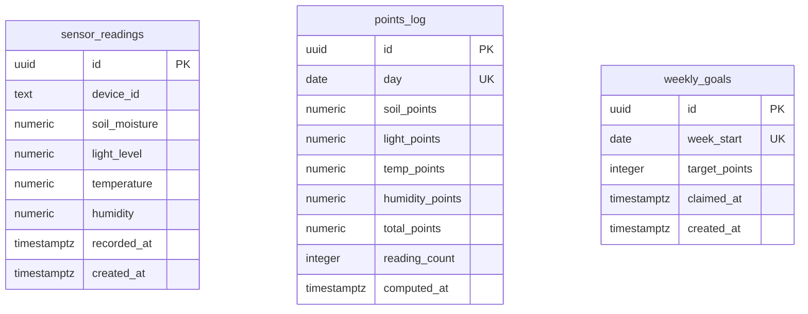

# Esquema de Base de Datos — Plant Tamagotchi

**Base de datos:** Supabase (PostgreSQL)
**Última actualización:** 2026-08-12

---

## Diagrama ER

> No hay foreign keys entre las tablas: `points_log` se **deriva** de `sensor_readings` agrupando por día (la relación es de cálculo, no referencial), y `weekly_goals` agrupa `points_log` por semana a través de la fecha. Ver `docs/features/puntos.md`.

---

## Índice de Tablas

| # | Tabla | Descripción | RLS | Políticas |
|---|-------|-------------|-----|-----------|
| 1 | `sensor_readings` | Lecturas del ESP32 (humedad de sustrato, luz, temperatura, humedad ambiente) | ✅ Activado | Ninguna (deliberado — ver abajo) |
| 2 | `points_log` | Puntos ganados por día, con desglose por métrica (derivado de `sensor_readings`) | ✅ Activado | Ninguna (deliberado) |
| 3 | `weekly_goals` | Meta semanal de 700 pts y si el premio ya fue reclamado | ✅ Activado | Ninguna (deliberado) |

---

## Tablas

### `sensor_readings`
Cada fila es una medición del dispositivo. Es la fuente de verdad del estado de la planta: alimenta la salud del modelo 3D, los puntos y los gráficos históricos.

| Columna | Tipo | Null | Default | Descripción |
|---------|------|------|---------|-------------|
| `id` | `uuid` | no | `gen_random_uuid()` | PK |
| `device_id` | `text` | no | `'esp32-01'` | Identificador del dispositivo |
| `soil_moisture` | `numeric(5,2)` | no | — | Humedad del sustrato, 0–100 % |
| `light_level` | `numeric(5,2)` | no | — | Nivel de luz, 0–100 % |
| `temperature` | `numeric(5,2)` | no | — | Temperatura, °C |
| `humidity` | `numeric(5,2)` | no | — | Humedad ambiente, 0–100 % |
| `recorded_at` | `timestamptz` | no | `now()` | Momento de la medición (lo envía el dispositivo) |
| `created_at` | `timestamptz` | no | `now()` | Momento de inserción en la DB |

**Constraints:** cada métrica tiene un `CHECK` con su rango físico plausible (ver la migración). La validación se hace además en la capa de API, para devolver un 400 explicativo en vez de un error de Postgres.

**Índices:**
- `sensor_readings_recorded_at_idx` sobre `(recorded_at desc)` — el dashboard pide la última lectura y los gráficos piden un rango, ambos ordenados por ese campo.

**RLS:** activado, **sin políticas**. Esto es deliberado, no un olvido: la app no usa Supabase Auth (ADR-002), así que no existe `auth.uid()` con el que discriminar filas. Sin políticas, la `anon key` (pública por diseño, viaja al browser) no puede leer ni escribir nada. Todo el acceso pasa por route handlers server-side con `SUPABASE_SERVICE_ROLE_KEY`, que bypassa RLS, detrás de la cookie de sesión o del `ESP32_INGEST_SECRET`. La autorización vive en la capa de API. Ver `docs/03-security.md`.

### `points_log`
Una fila por día, con el desglose de puntos por métrica. **Es una tabla derivada:** todo su contenido se puede reconstruir desde `sensor_readings`. Existe como caché/histórico para no recalcular la semana entera en cada request y para conservar el desglose aunque más adelante se purguen lecturas viejas.

| Columna | Tipo | Null | Default | Descripción |
|---------|------|------|---------|-------------|
| `id` | `uuid` | no | `gen_random_uuid()` | PK |
| `day` | `date` | no | — | Día calendario. **UNIQUE** |
| `soil_points` | `numeric(5,2)` | no | `0` | Puntos por humedad del sustrato (máx. 50) |
| `light_points` | `numeric(5,2)` | no | `0` | Puntos por luz (máx. 25) |
| `temp_points` | `numeric(5,2)` | no | `0` | Puntos por temperatura (máx. 15) |
| `humidity_points` | `numeric(5,2)` | no | `0` | Puntos por humedad ambiente (máx. 10) |
| `total_points` | `numeric(5,2)` | no | `0` | Suma de los cuatro (máx. 100) |
| `reading_count` | `integer` | no | `0` | Cuántas lecturas hubo ese día (0 ⇒ 0 pts) |
| `computed_at` | `timestamptz` | no | `now()` | Último recálculo |

**Por qué `day` es UNIQUE:** el guardado es un `upsert` con `onConflict: 'day'`. El día en curso se recalcula en cada request, y una lectura atrasada del ESP32 corrige un día ya cerrado en vez de duplicarlo.

**Índices:** `points_log_day_idx` sobre `(day desc)`.

---

### `weekly_goals`
Una fila por semana (lunes como primer día). Guarda lo único que **no** se puede derivar de los sensores: si el premio de esa semana ya fue reclamado.

| Columna | Tipo | Null | Default | Descripción |
|---------|------|------|---------|-------------|
| `id` | `uuid` | no | `gen_random_uuid()` | PK |
| `week_start` | `date` | no | — | Lunes de la semana. **UNIQUE** |
| `target_points` | `integer` | no | `700` | Meta de la semana (se guarda por fila para poder ajustarla sin reescribir el historial) |
| `claimed_at` | `timestamptz` | **sí** | — | `null` ⇒ no reclamado. Marca de tiempo del reclamo |
| `created_at` | `timestamptz` | no | `now()` | Alta de la fila |

**Reclamo idempotente:** `claimWeeklyGoal()` hace `update ... where week_start = $1 and claimed_at is null`. Si dos requests entran juntos, solo uno afecta filas; el otro no pisa la marca de tiempo original.

---

## Historial de Migraciones

| # | Archivo | Fecha | Descripción | Estado |
|---|---------|-------|-------------|--------|
| 0001 | `supabase/migrations/0001_sensor_readings.sql` | 2026-08-12 | Tabla `sensor_readings` + índice + RLS | ✅ Aplicada (2026-08-12) |
| 0002 | `supabase/migrations/0002_points.sql` | 2026-08-12 | Tablas `points_log` y `weekly_goals` + índice + RLS | ✅ Aplicada (2026-08-12) |

### Cómo aplicar una migración
No hay CLI de Supabase ni connection string de Postgres configurados en este entorno, así que las migraciones se aplican a mano:
1. Entrar al proyecto en Supabase → **SQL Editor**.
2. Pegar el contenido del archivo `.sql` de la migración.
3. Ejecutar (**Run**).
4. Marcar la migración como aplicada en la tabla de arriba.

Ambas migraciones ya están aplicadas en el proyecto real (verificado el 2026-08-12 con requests directos a la REST API de Supabase).

---

## Resumen RLS

| Tabla | SELECT | INSERT | UPDATE | DELETE |
|-------|--------|--------|--------|--------|
| `sensor_readings` | ❌ anon · ✅ service role | ❌ anon · ✅ service role | ❌ anon · ✅ service role | ❌ anon · ✅ service role |
| `points_log` | ❌ anon · ✅ service role | ❌ anon · ✅ service role | ❌ anon · ✅ service role | ❌ anon · ✅ service role |
| `weekly_goals` | ❌ anon · ✅ service role | ❌ anon · ✅ service role | ❌ anon · ✅ service role | ❌ anon · ✅ service role |

---

## Notas de Planeamiento (no implementado todavía)

Ninguna tabla pendiente. Las features que faltan (`graficos`, `confeti`, `pwa`) se resuelven sobre las tablas ya existentes o sin tocar la DB.
